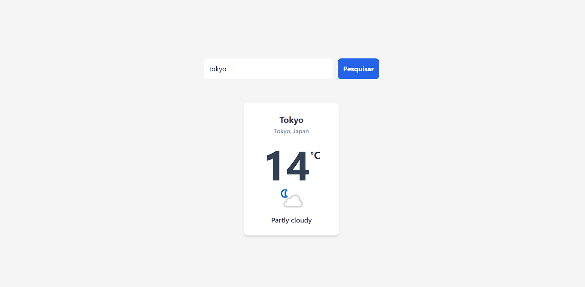

<h1 align="center"> Weather App </h1>

 App para previsão do tempo. 

    <a href="#sobre">sobre</a> •
    <a href="#tecnologias">tecnologias</a> •
    <a href="#autor">autor</a> 

<!-- <h4 align="center">🚧  This project is under construction . . .  🚧 </h4> -->

Você pode checar o projeto<a href="https://weather-ythiago03.vercel.app/"> clicando aqui.</a>

# Sobre

- A ideia do projeto é criar um app em React consuminto a API WeatherAPI.
 
# Tecnologias

As seguintes tecnologias foram usadas no projeto:

- <a href="https://developer.mozilla.org/pt-BR/docs/Web/HTML">HTML5</a>
- <a href="https://developer.mozilla.org/pt-BR/docs/Web/CSS">CSS3</a>
- <a href="https://developer.mozilla.org/pt-BR/docs/Web/JavaScript">JavaScript</a>
- <a href="https://react.dev/learn">React</a>

# Autor

Feito com 💜 por Thiago Henrique ✨<a href="https://www.linkedin.com/in/thiago-fid%C3%AAncio-a24578224/">Veja meu linkedin</a>
